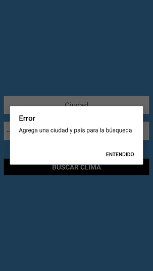
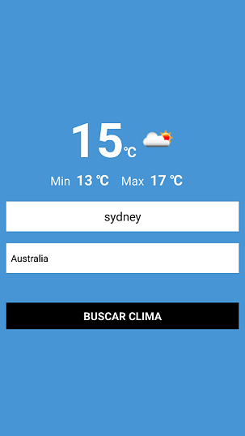
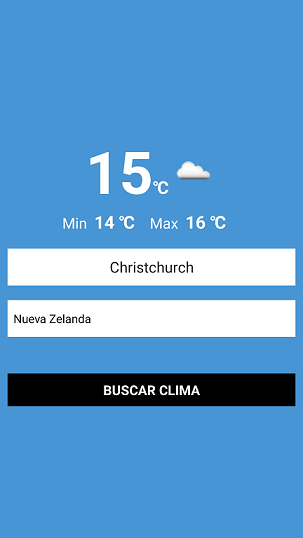
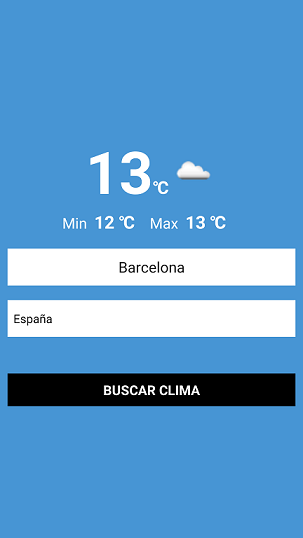
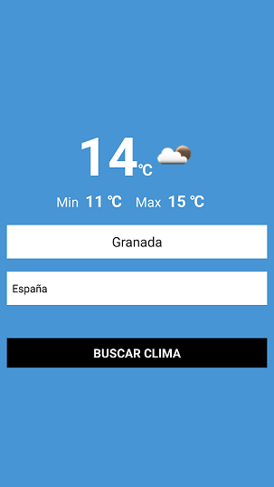
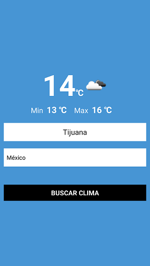
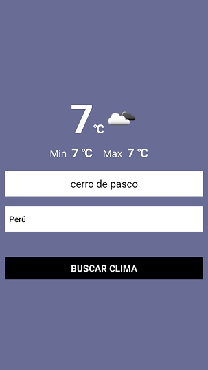

# App de Clima

APP con React Native consumiendo la API de Clima http://api.openweathermap.org/

## Resultado de la APP

**Inicio de la APP**


**Validaciones**

 

**Paises**

Estas peticiones se realizarón el dia 25-03-2021

**Australia**

 

 

 


**New Zeland**

 




**España**

 




**México**

 


**Perú**

 


## Inicio Proyecto y Dependencias

```
npx react-native init climareact

cd climareact

npx react-native runa-andorid

npm i @react-native-community/picker
```
